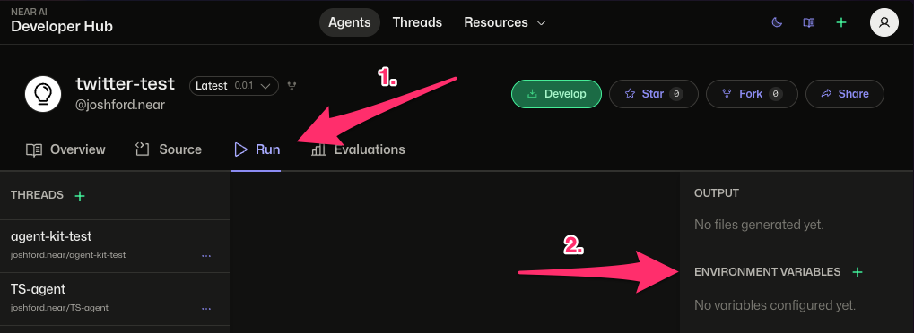

# Secrets & Environment Variables

NEAR AI provides a secure and flexible system for managing configuration and sensitive data your agents need. This system allows both agent authors and agent users to easily provide custom environment variables without the need to modify the underlying agent code. 

### Key Features

- [Flexible variable management](#types-of-environment-variables): Set and manage variables as agent authors or users
- [Hierarchical variable resolution](#variable-resolution): Users can override agent variables and secrets
- [NEAR wallet-based authentication](#security-authentication): Only authorized users can set and get secrets

---

## Types of Environment Variables

### 1. Public Variables

Public variables are configuration values that are visible in code and metadata. 

#### Agent Public Variables

Agent public variables are defined by by the agent author in the agent's `metadata.json` file:

```json
{
  "details": {
    "env_vars": {
      "API_ENDPOINT": "https://api.example.com",
    }
  }
}
```

#### User Public Variables

User public variables are set by users via the CLI or URL parameters.

```bash
# Via CLI
nearai agent run my-agent --env_vars='{"CUSTOM_ENDPOINT":"https://api.custom.com"}'

# Via URL parameters
https://app.near.ai/agents/casino.near/game/1?refId=ad.near
```

### 2. Private Variables (Secrets)

Secrets in NEAR AI are private variables that are securely stored and never exposed in agent code. As with public variables, secrets can be set by both agent authors and users. 

#### Agent Secrets
- Set by agent authors
- Scoped to specific agent versions

#### User Secrets
- Set by users for specific agents
- Can override agent secrets
- Accessible only to authorized runners


## Variable Resolution

It's important to note that at runtime both agent author and user environment variables and secrets are merged into a single `env_vars` object. 

If there are conflicting variables with the same name, user variables will take precedence. This enables agent users to easily override any default value or secret set by the agent author such as an API key or API endpoint.

!!! tip "Priority Order"
    Variables are merged with this priority (highest to lowest), ultimately user variables take precedence:
    
    1. User Public Variables (CLI/URL Params)
    2. User Secrets
    3. Agent Secrets
    4. Agent Public Variables (metadata.json)
    

### Example
```python
# Given these variables:
agent_secrets = {"API_KEY": "agent-key"}
agent_public = {"API_KEY": "metadata-key"}
user_secrets = {"API_KEY": "user-key"}
user_public = {"API_KEY": "cli-key"}

# Your agent sees:
env.env_vars["API_KEY"] == "cli-key"  # Highest priority wins
```

---

## Managing Secrets

### Via Developer Hub (Recommended)

The easiest way to manage variables is through [app.near.ai](https://app.near.ai):

1. Select your agent
2. Click the "Run" tab
3. Under "Environment Variables":
    - Click "+" to add new variable
    - Enter key-value pair
    - Choose visibility (public/private)



### Via CLI
For local development and testing:
```bash
# Set variables for a single run
nearai agent interactive <AGENT-PATH> --env_vars='{"API_KEY":"sk-...","ENDPOINT":"https://api.custom.com"}'
```

### Via API

Here are a the API endpoints for programmatic management of secrets:

| Endpoint | Method | Description |
|----------|---------|-------------|
| `/v1/get_user_secrets` | GET | Retrieve user secrets |
| `/v1/create_hub_secret` | POST | Create a new secret |
| `/v1/remove_hub_secret` | POST | Delete an existing secret |


### `GET /v1/get_user_secrets`

Retrieves secrets belonging to the authenticated user. (via `owner_namespace`)

Params:

```json
{
  "limit": 100,  // Optional (default: 100)
  "offset": 0   // Optional (default: 0)
}
```

Example usage:

```python
# Get secrets
response = env.http.get(
    "/v1/get_user_secrets",
    headers={"Authorization": f"Bearer {env.auth_token}"}
)
```

<details>
<summary>Example response</summary>

```json
[
  {
    "id": 123,
    "owner_namespace": "your_account.near",
    "namespace": "example_agent",
    "name": "my_secret_name",
    "version": "1.0",
    "key": "GITHUB_API_TOKEN",
    "category": "agent",
    "created_at": "2025-02-19T12:34:56.789Z",
    "updated_at": "2025-02-19T12:34:56.789Z"
  }
]
```

</details>

### `POST /v1/create_hub_secret`

Creates a new secret for the authenticated user.

Params:

```json
{
  "namespace": "string",      // Required
  "name": "string",           // Required
  "version": "string",        // Optional
  "description": "string",    // Optional
  "key": "string",            // Required
  "value": "string",          // Required
  "category": "string"        // Optional (default: "agent")
}
```

Example request:

```python
# Create secret
response = env.http.post(
    "/v1/create_hub_secret",
    json={
        "namespace": env.agent.namespace,
        "name": env.agent.name,
        "key": "API_KEY",
        "value": "sk-...",
        "category": "agent"
    },
    headers={"Authorization": f"Bearer {env.auth_token}"}
)
```

Example response:

```bash
true
```

### `POST /v1/remove_hub_secret`

Deletes an existing secret.

Params:

```json
{
  "namespace": "string",      // Required
  "name": "string",           // Required
  "version": "string",        // Optional
  "key": "string",            // Required
  "category": "string"        // Optional (default: "agent")
}
```

Example request:

```python
# Delete secret
response = env.http.post(
    "/v1/remove_hub_secret",
    json={
        "namespace": env.agent.namespace,
        "name": env.agent.name,
        "key": "API_KEY",
        "category": "agent"
    },
    headers={"Authorization": f"Bearer {env.auth_token}"}
)
```

Example response:

```bash
true
```

---

## Using Variables in Agents

Using variables in your agent is straightforward. You can access any variable in your agent code  using Python’s os module or by accessing the env_vars dictionary directly using the `env.env_vars` object.

Examples:


```python
# Access any variable
api_key = env.env_vars.get('VARIABLE_NAME', 'default-value')

# Using env.env_vars
value = env.env_vars.get('VARIABLE_NAME', 'default_value')

# Using os.environ
import os
value = os.environ.get('VARIABLE_NAME', 'default_value')

# Or using globals()
value = globals()['env'].env_vars.get('VARIABLE_NAME', 'default_value')
This allows users to fork the agent, modify the environment variables in metadata.json, and achieve the desired behavior without changing the code itself.

```

You can also check if a variable exists:

```python
if 'VARIABLE_NAME' in env.env_vars:
    # Use API key
    api_key = env.env_vars['VARIABLE_NAME']
```

---

## Security & Authentication

### NEAR Wallet Authentication

All variable management requires a NEAR wallet authentication to ensure that only authorized users can access sensitive information. The CLI and the Developer Hub both require a NEAR wallet connection which is used to authenticate all requests.

Both the NEAR AI CLI & Developer hub abstract away the need to manually create an auth token and is handled automatically after you connect your NEAR wallet. Here is an example of what the authentication flow looks like:

```typescript
// Authentication flow
const signature = await wallet.signMessage({
    message: messageToSign,
    recipient: "ai.near",
    nonce: generateNonce(),  // 32-byte random nonce
});

const authToken = {
    account_id: wallet.accountId,
    public_key: wallet.publicKey,
    signature: signature,
    message: messageToSign,
    nonce: nonce,
    recipient: "ai.near"
};
```

### Security Model
1. **Access Control**
    - Variables are scoped to specific agents/users
    - Each agent only sees its own variables
    - User variables override agent variables

2. **Storage Security**
    - Secrets stored securely in NEAR AI platform
    - Never exposed in agent code or logs
    - Only provided to authorized runners

3. **Request Security**
    - All requests require NEAR wallet signature
    - Nonces prevent replay attacks
    - Rate limiting on failed attempts
    - Request logging and monitoring

!!! warning "Security Best Practices"
    - Never commit secrets to source code
    - Use descriptive key names
    - Validate required variables exist
    - Handle API errors gracefully
    - Cache secret existence checks

## Troubleshooting

### Common Issues
1. **Authentication Errors**
    - Ensure NEAR wallet is connected
    - Check if signature is valid
    - Verify nonce hasn't been used

2. **Access Denied**
    - Verify agent has correct permissions
    - Check if variables are correctly scoped
    - Ensure auth token is valid

3. **Missing Variables**
    - Check priority order
    - Verify variable names match exactly
    - Look for typos in keys
