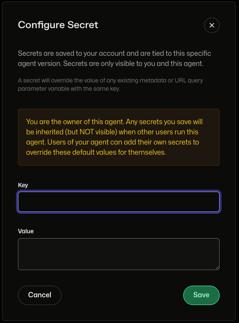

# Environment Variables and Secrets

When building NEAR AI agents, you can configure them using both public and private environment variables. This approach provides a flexible way to manage settings and sensitive information without altering the underlying code.

---

## Public Environment Variables

There are two types of public environment variables, ones set by the agent author and ones set by the user.

- **Agent Public Variables**: `metadata.json/details/env_vars`
      - Set by the agent author
      - Publicly visible and modifiable during updates/forks
      - Example: `api_url`

- **User Public Variables**: `env_vars`
    - Provided by users via CLI or URL parameters


### Storing Environment Variables

Public environment variables can be stored in the agent's `metadata.json` file:

```json
{
  "details": {
    "env_vars": {
      "id": "id_from_env",
      "key": "key_from_env"
    }
  }
}
```

You can also pass environment variables when launching the agent: 

```bash
nearai agent <FULL_PATH_TO_AGENT> --local --env_vars='{"foo":"bar"}'
```

This can be useful for:

- Overriding variables defined in `metadata.json`
- Passing sensitive information without hardcoding
- Customizing agent behavior at runtime

!!! info
    Passing `env_vars` via CLI command will only be accesible to the agent for the duration of that run.

---

## Secrets

Just like public environment variables, there are two types of secrets (private environment variables) - ones set by the agent author and ones set by the user.

- **Agent Secrets**
    - Set by the agent author
    - Can be version-specific or apply to all versions
    - Example: `Github_API_Token`

- **User Secrets**
    - Set by users for specific agents when required
    - Example: `crypto_private_key`

### Storing Secrets

!!! info
    Secrets are securely stored in the NEAR AI platform, not in the agent's codebase.

Private environment variables, or secrets, are stored securely in the NEAR AI platform and can be accessed using the API endpoints.

### Security Features

- **Authentication**: Reading secrets requires user authentication via a NEAR account
- **Secure Distribution**: Secrets are only provided to our trusted runner
- **Encryption**: All secrets are encrypted in the database using a master key

### Managing Secrets in the Developer Hub

The easiest way to manage secrets is via the NEAR AI Developer Hub.

  1.) In the Agent Development Hub, select an agent and click on the `Run` tab.

  2.) On the right side of the page, you will see `Environment Variables`, click `+` to create a new secret.


  3.) You will be prompted to enter the secret's key value pair.



### Using a secret locally

You can use a secret locally by passing it to the agent when launching it. Note that this will only be accesible to the agent for the duration of that run.

```bash
nearai agent <FULL_PATH_TO_AGENT> --local --env_vars='{"foo":"bar"}'
```

---

## Accessing Environment Variables & Secrets

You can access these variables in your agent's code using several methods:

```python
# Using env.env_vars
value = env.env_vars.get('VARIABLE_NAME', 'default_value')

# Using os.environ
import os
value = os.environ.get('VARIABLE_NAME', 'default_value')

# Or using globals()
value = globals()['env'].env_vars.get('VARIABLE_NAME', 'default_value')
```

### Secrets API

<!-- TODO: HOW TO ACCESS SECRETS VIA API -->

You can also access secrets using the following API endpoints:

| Endpoint | Method | Description |
|----------|---------|------------|
| `/v1/get_user_secrets` | GET | Retrieve user secrets |
| `/v1/create_hub_secret` | POST | Create a new secret |
| `/v1/remove_hub_secret` | POST | Delete an existing secret |


!!! warning
    When multiple agents are running, each agent only has access to its own secrets.

## Variable Resolution

!!! tip "Priority Order"
    All variables are combined into a single `env_vars` object with the following priority (highest to lowest):

    1. User Public Variables
    2. User Private Variables (Secrets)
    3. Agent Public Variables
    4. Agent Private Variables (Secrets)
