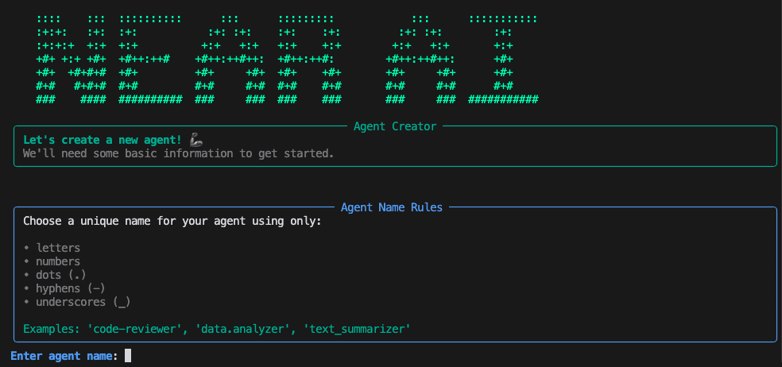

# Agents Quickstart

In this Quickstart you will learn how to setup NEAR AI and then use it to build & interact with an AI agent in less than one minute. 🏃‍♂️

NEAR AI Agents are programs that can act autonomously to solve a task, while adapting and reacting to their environment. 
These agents can use various AI models, store data to remember past interactions, communicate with other agents, use tools to 
interact with the environment, and much more.

---

## ⚠️ Prerequisites

Before creating a NEAR AI agent, please make sure you have the [NEAR AI CLI](../cli.md) installed and have logged in with your Near wallet.

---

## Create an Agent

You can create a new agent by running the following command using the [NEAR AI CLI](../cli.md):

```bash
nearai agent create
```
You will then be prompted to provide a few details about your agent:

1. The name of your agent.
2. A short description of your agent.
3. Initial instructions for the agent (which can be edited later).



Once you have complete these three prompts, you'll see a summary to verify the information is correct:


If everything looks good, press `y` to build your agent. Once complete, you should see a confirmation screen similar to this:


Here you will find:

1. Where the agent was created:

    `/home_directory/.nearai/regisitry/<your-account.near>/<agent-name>/0.0.1`

2. Useful commands to get started interacting with it:

    ```bash
    # Run agent locally
    nearai agent interactive <path-to-agent> --local

    # Select from a list of agents you created to run locally
    nearai agent interactive --local
    
    # Upload agent to NEAR AI's public registry
    nearai registry upload <path-to-agent>
    ```

Success! You now have a new AI Agent ready to use! :tada: 

---

## Agent Files

During the agent creation process, `nearai` builds your agent in your local AI registry located at:

`/home_directory/.nearai/registry/<your-account.near>/<agent-name>/0.0.1` 

This folder contains two files that define your agent:

1. `metadata.json`: Contains information / configuration about your agent.
2. `agent.py`: Python code that executes each time your agent receives a prompt.

---

### `metadata.json`

This file contains your agent information and configuration settings.

```json title="metadata.json"

{
  "name": "example-agent",
  "version": "0.0.1",
  "description": "NEAR AI docs example agent ;)",
  "category": "agent",
  "tags": [],
  "details": {
    "agent": {
      "defaults": {
        "model": "llama-v3p1-70b-instruct",
        "model_provider": "fireworks",
        "model_temperature": 1.0,
        "model_max_tokens": 16384
      }
    }
  },
  "show_entry": true
}

```


#### AI Model

[Llama 3.1 70B Instruct](https://huggingface.co/meta-llama/Llama-3.1-70B-Instruct) is currently the default model for agents but you can easily change it by selecting one from [app.near.ai/models](https://app.near.ai/models) and updating your JSON file.

You can also fine tune and serve a model to fit your specific needs. (See [Fine Tuning](../models/fine_tuning.md))

#### Python Package Support

There are different frameworks for agents that define which Python packages they support and is configured in your `metadata.json` file. 

```json
{
  "details": {
    "agent": {
      "framework": "standard"  // or "minimal", "ts", "agentkit", etc.
    }
  }
}
```

See [Supported Packages](./env/frameworks.md) for more information.

#### Message Attachements

Agents can accept attached files during an interactive session by setting `allow_message_attachments` to `true`. 
You can also specify what types of files your agent will accept.

```json
{
  "details": {
    "agent": {
      "allow_message_attachments": true,
      "allow_message_attachments_accept_mime_types": [
        "image/*",
        "application/pdf"
      ]
    }
  }
}
```


### `agent.py`

This file contains the code that executes each time your agent receives a prompt. By default it will use simple instructions provided by the user during the creation process.

For more information on how to use the environment object, see [The Agent Environment](./env/overview.md).

For additional examples, see the [NEAR AI Official Agents](https://github.com/nearai/official-agents) or the [NEAR AI Public Registry](https://app.near.ai/agents).

```python title="agent.py"
from nearai.agents.environment import Environment


def run(env: Environment):
    # A system message guides an agent to solve specific tasks.
    prompt = {"role": "system", "content": "You are a helpful agent that will educate users about NEAR AI."}

    # Use the model set in the metadata to generate a response
    result = env.completion([prompt] + env.list_messages())

    # Store the result in the chat history
    env.add_reply(result)

    # Give the prompt back to the user
    env.request_user_input()

run(env)
```

---

## Next Steps

Now that you have the basics down, here are some key areas to focus on next that will help you better understand what is possible when building with NEAR AI:

### [Ship your agent 🚀](./registry.md#uploading-an-agent)

Upload your agent to the agent registry and [easily embed it into your website](./registry.md#embedding-an-agent).

### [Explore the Registry 🔍](./registry.md)

The NEAR AI Registry is your hub for agent discovery and collaboration. Browse community-created agents, learn from examples, and share your own creations with others.

### [Master Threads 💬](./threads.md)

Threads power agent execution and interaction. Learn to structure conversations, manage file attachments, and create coordinated multi-agent interactions - all within organized conversation threads. 

### [Explore the Environment 🧑‍💻](./env/overview.md)

The environment object unlocks NEAR AI's powerful features:

- Create natural conversations with [advanced message handling](./env/messages_files.md)
- Leverage AI models for [intelligent decision-making](./env/inference.md)
- Enable [agent-to-agent communication](./patterns/agent_to_agent.md)
- Extend capabilities with [custom tools](./env/tools.md)

### [Learn About Secrets and Variables 🔑](./env/variables.md)

Learn how to manage environment variables and secure with proper secrets management. Store API keys safely and connect to external services with confidence.
