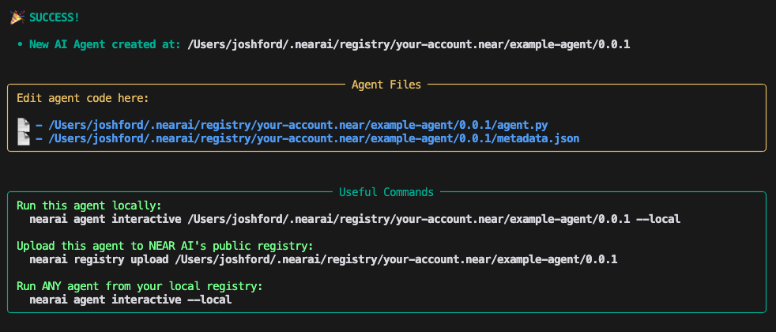

# NEAR AI Quickstart

In this Quickstart you will learn how to setup NEAR AI and then use it to build & interact with an AI agent in less than one minute. 🏃‍♂️

NEAR AI Agents are programs that can act autonomously to solve a task, while adapting and reacting to their environment. 
These agents can use various AI models, store data to remember past interactions, communicate with other agents, use tools to 
interact with the environment, and much more.

---

## Setup

### Pre-Requisites

- [NEAR Account](https://wallet.near.org/)
- [NEAR AI CLI](#installing-near-ai-cli)

---

### Installing NEAR AI CLI

=== "pip"

    ``` bash
    python3 -m pip install nearai
    ```

=== "local"

    ``` bash
    git clone git@github.com:nearai/nearai.git
    cd nearai
    pip install -e .
    ```

??? abstract "Python Version"

    If you do not have python, or your version is not compatible, we recommend that you use [miniconda](https://docs.anaconda.com/miniconda/install/) or [pyenv](https://github.com/pyenv/pyenv)
    to manage your installations, as they both allow you to easily switch between python versions.

    === "pyenv"

        ``` bash
        pyenv install 3.11
        pyenv local 3.11 # or use global
        ```

    === "conda"

        ``` bash
        conda create -n myenv python=3.11
        conda activate myenv
        ```

---

### Login to NEAR AI

To create a new agent, first login with a [NEAR Account](https://wallet.near.org/):

``` bash
nearai login
```

??? tip "Don't have a NEAR Account?"

    If you do not have a NEAR account, you can create one for free using wallets listed at [wallet.near.org](https://wallet.near.org/). 
    
    If you are unsure of which one to choose, try out [Bitte](https://wallet.bitte.ai) or [Meteor Wallet](https://wallet.meteorwallet.app/add_wallet/create_new).

You'll be provided with a URL to login with your NEAR account.

Example:

``` bash
$> nearai login

Please visit the following URL to complete the login process: https://auth.near.ai?message=Welcome+to+NEAR+AI&nonce=<xyzxyzxyzxyzx>&recipient=ai.near&callbackUrl=http%3A%2F%2Flocalhost%3A63130%2Fcapture
```

After successfully logging in, you will see a confirmation screen. Close it and return to your terminal.


??? tip Other Login Methods

    If you have already logged in on `near-cli`, you know your account's private key, or you have the credentials on another device, you can use the following commands to login:

    ```bash
    ### Login with NEAR Account ID Only
    nearai login --accountId name.near

    ### Login with Account ID and Private Key
    nearai login --accountId name.near --privateKey key

    ### Login Remotely (only displays the login URL)
    nearai login --remote
    ```

---

## Create an Agent

After logging in, you can create a new agent by running the following command:

```bash
nearai agent create
```
You will then be prompted to provide a few details about your agent:

1. The name of your agent.
2. A short description of your agent.
3. Initial instructions for the agent (which can be edited later).


Once you have complete these three prompts, you'll see a summary to verify the information is correct:


If everything looks good, press `y` to build your agent. Once complete, you should see a confirmation screen similar to this:



Here you will find:

1. Where the agent was created:

    `/home_directory/.nearai/regsitry/<your-account.near>/<agent-name>/0.0.1`

2. Useful commands to get started interacting with it:

    ```bash
    # Run agent locally
    nearai agent interactive <path-to-agent> --local

    # Select from a list of agents you created to run locally
    nearai agent interactive --local
    
    # Upload agent to NEAR AI's public registry
    nearai registry upload <path-to-agent>
    ```

Success! You now have a new AI Agent ready to use! :tada: 

---

## Agent Files

During the agent creation process, `nearai` builds your agent in your local AI registry located at:

`/home_directory/.nearai/registry/<your-account.near>/<agent-name>/0.0.1` 

This folder contains two files that define your agent:

1. `metadata.json`: Contains information / configuration about your agent.
2. `agent.py`: Pythoncode that executes each time your agent receives a prompt.

---

### `metadata.json`

This file contains information about your agent including configuration for the model it will use, [Llama 3.1 70B Instruct](https://huggingface.co/meta-llama/Llama-3.1-70B-Instruct) being the default. To use a different model, select one from [app.near.ai/models](https://app.near.ai/models) and update your JSON file defaults. 

Additionaly, you can fine tune and serve a model to fit your specific needs. (See [Fine Tuning](../../models/fine_tuning))

```json title="metadata.json"

{
  "name": "example-agent",
  "version": "0.0.1",
  "description": "NEAR AI docs example agent ;)",
  "category": "agent",
  "tags": [],
  "details": {
    "agent": {
      "defaults": {
        "model": "llama-v3p1-70b-instruct",
        "model_provider": "fireworks",
        "model_temperature": 1.0,
        "model_max_tokens": 16384
      }
    }
  },
  "show_entry": true
}

```

### `agent.py`

This file contains the code that executes each time your agent receives a prompt. By default it will use simple instructions provided by the user during the creation process. 

For more information on how to use the environment object, see [The Agent Environment](./env/overview.md).

For additional examples, see the [NEAR AI Official Agents](https://github.com/nearai/official-agents) or the [NEAR AI Public Registry](https://app.near.ai/agents).

```python title="agent.py"
from nearai.agents.environment import Environment


def run(env: Environment):
    # A system message guides an agent to solve specific tasks.
    prompt = {"role": "system", "content": "You are a helpful agent that will educate users about NEAR AI."}

    # Use the model set in the metadata to generate a response
    result = env.completion([prompt] + env.list_messages())

    # Store the result in the chat history
    env.add_reply(result)

    # Give the prompt back to the user
    env.request_user_input()

run(env)
```

## Next Steps

Congratulations! You have created your first agent on NEAR AI. Now you can modify the agent's code to help you solve a specific task. To discover everything an agent can do we recommend you to explore the following sections:

- [Registry](./registry.md): NEAR AI has an open registry, where you can find agents created by the community and even publish your own.

- [Threads](./threads.md): Agents execute in conversation threads, which can contain files, messages, and interactions with other agents.

- [The Agent Environment](./env/overview.md): Agents have access to the environment object, which allows them to [interact with the user](./env/messages_files.md), use AI models to make [inferences](./env/inference.md), [call other agents](./env/calling_other_agents.md), use [tools](./env/tools.md), and much more. 

- [Secrets](./secrets.md): Agents can store secrets to access external services, like APIs, databases, or other services.