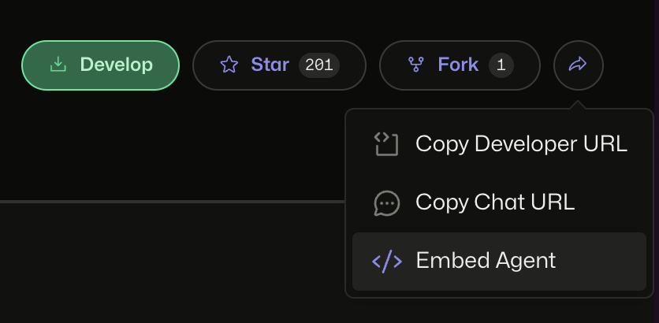

# Agent Registry: Finding and Publishing Agents

NEAR AI agents can be deployed and hosted in a common registry, allowing the community to share their creations. This registry is used by the [NEAR AI Developer Hub](https://app.near.ai/agents) to store and serve agents.

Let's take a look at how we can navigate this registry, download agents, and contribute our own agents to the ecosystem.

!!! note
    The agent registry is backed by an S3 bucket with metadata stored in a database.

---

## Finding an Agent

There are two main ways to navigate the agent registry to discover agents: 

- [NEAR AI Developer Hub](https://app.near.ai/agents)
- [NEAR AI CLI](./quickstart.md)

For the rest of this guide, we will use the CLI to find and deploy agents. 

!!! tip
    Refer to the [Quickstart Guide](./quickstart.md) to learn how to install the CLI and login to the AI Developer Hub.

### View all agents

To view all agents with `nearai` CLI, run:

```bash
nearai registry list --category agent
```

??? experiment "Example Output"

    ```shell
    ┌─────────────────────────────────┬─────────────────────────┬───────┐
    │ entry                           │ description             │ tags  │
    ├─────────────────────────────────┼─────────────────────────┼───────┤
    │ zavodil.near/ai16z-docs/1.03    │ AI agent with AI16Z ... │ agent │
    ├─────────────────────────────────┼─────────────────────────┼───────┤
    │ flatirons.near/common-tool...   │ A library of common ..  │ llama │
    ├─────────────────────────────────┼─────────────────────────┼───────┤
    │ jayzalowitz.near/example_a...   │ Example agent           │       │
    ├─────────────────────────────────┼─────────────────────────┼───────┤
    │ ...                             │ ...                     │ ...   │
    └─────────────────────────────────┴─────────────────────────┴───────┘
    ```

<hr class="subsection" />

### Filtering Agents

You can further filter the agents with two flags:

- `--namespace` : The developer that created it
- `--tags`: Any tags that were added to the agent

For example, to find all agents created by `gagdiez.near` with the tag `template`, run:

```bash
nearai registry list  --category agent \
                      --namespace gagdiez.near \
                      --tags template \
                      --show_all
```

!!! tip
    You can use the `info` command to get more details about a specific agent, for example:

    ```bash
    nearai registry info gagdiez.near/hello-ai/latest
    ```

---

## Downloading an Agent

Once you find an agent that you would like to download, use the `download` command to save it locally. Agent details are passed in the following format:

```bash
nearai registry download <account.near>/<agent_name>/<version>
```

The `version` can be a specific version number, or `latest` to download the most recent version.

 Example: 

```bash 
# Download a hello world agent
nearai registry download gagdiez.near/hello-ai/latest
```

This command saves the agent locally in `.nearai/registry` under your home directory.

The example above would save to: `~/.nearai/registry/gagdiez.near/hello-ai/latest`.

!!! tip
    The `--force` flag allows you to overwrite the local agent with the version from the registry.

---

## Uploading an Agent

If you created an agent and would like to share it with others, you can upload it to the registry. To upload an agent, you must be [**logged in**](./quickstart.md#login-to-near-ai).

The `upload` command requires the path to the agent folder stored locally, for example:

```bash
nearai registry upload ~/.nearai/registry/<your-account.near>/<agent_folder>
```

The folder must contain:

- `agent.py`: Agent logic
- `metadata.json`: Agent information _(ex: description, tags, and model, etc.)_

??? note "Example `metadata.json` file"

    ```json title="metadata.json"
    {
    "name": "hello-ai",
    "version": "0.0.1",
    "description": "A friendly agent",
    "category": "agent",
    "tags": [],
    "details": {
      "agent": {
        "defaults": {
          "model": "llama-v3p1-70b-instruct",
          "model_provider": "fireworks",
          "model_temperature": 1.0,
          "model_max_tokens": 16384
        }
      }
    },
    "show_entry": true
    }
    ```

!!! tip "Tags"
    Remember to add tags to your agent to make it easier for others to find it in the registry, for example:
    
    ```json
    { "tags": ["travel", "assistant", "vacation"] }
    ```

!!! danger
    **All files** in this folder **will be uploaded** to the registry which is **PUBLIC!** Make sure you are not including any sensitive data.

!!! warning
    You can't remove or overwrite a file once it's uploaded, but you can hide the entire agent by setting the `"show_entry": false` field in the `metadata.json` file

---

## Embedding an Agent

You can embed NEAR AI agents directly into your website using an iframe. This allows users to interact with your agent without leaving your site.

### Basic Embedding

To embed an agent, use the following iframe code replacing the `src` with the agent you want to embed.

`Example`:

```html
<iframe 
  src="https://app.near.ai/embed/<your-account.near>/<your-agent-name>/latest" 
  sandbox="allow-scripts allow-popups allow-same-origin allow-forms"
  style="border: none; height: 100svh;">
</iframe>
```

!!! info
    - Note that the difference with this `src` path compared to a regular link to your agent is that it is using the `embed` endpoint.

    - Also note that you can replace the `latest` with a specific agent version number.

!!! tip
    You can also copy/paste the snippet from the [NEAR AI Dev Platform](https://app.near.ai/agents).
    
    - Clicking the `share` icon from your agent page and select `<embed>`

    

### Customizing the Embed

<!-- TODO: Enhance this section for all the customization options available. -->

In addition to customizing the agent's iframe, you can also customize how your agent appears when embedded by updating the `metadata.json` file.

Add an `embed` section under the agent details:

```json
{
  "details": {
    "agent": {
      "embed": {
        "logo": "https://near.ai/logo-white.svg"
      }
    }
  }
}
```

!!! info
    The embedded agent will inherit the styling of the NEAR AI platform while maintaining a consistent look and feel with your website.
