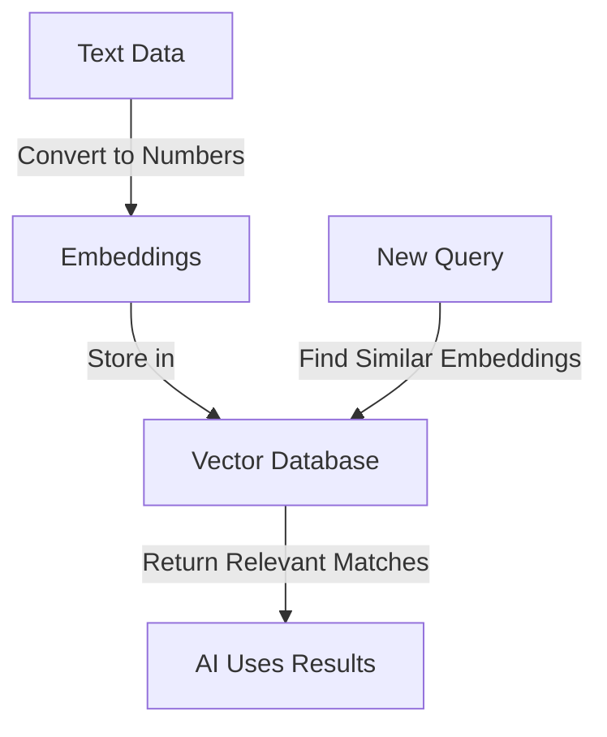

#  Create Vector Store 

Imagine you're building an AI assistant, but it **forgets everything** the moment a conversation ends. Frustrating, right? That’s where **vector stores** come in—they act as your AI’s **long-term memory**, letting it **remember, retrieve, and reason** over vast amounts of information.

### What’s a Vector Store, Anyway?

Think of a **vector store as a search engine for AI**—but instead of looking up exact words, it finds meaning by comparing **mathematical representations of text, images, or data**. These representations are called **embeddings**, which are essentially **words converted into numerical vectors** that capture their meaning. They exist in a high-dimensional space, where similar concepts are closer together—like how **"dog"** and **"canine"** would be near each other, while **"car"** and **"pizza"** would be far apart—unless you're searching for drive-thru pizza.


Here's a visualization to explain how a **Vector store work**:



---

### Let’s Create a Vector Store for Study Notes
Imagine you’re building an AI tutor that helps students with Machine Learning concepts. 
We’ll store study notes in a vector store and query it for answers.

---

### Step 1: Install & Authenticate NEAR AI
Before anything, [install NEAR AI’s CLI](../../cli.md) and log in:\
    - Installs the NEAR AI Python client.
    - Authenticates your NEAR AI account (stores credentials in `~/.nearai/config.json`).  

```bash
pip install nearai  # Install NEAR AI client
nearai login        # Authenticate with your NEAR AI account
```

---

### Step 2: Create a Vector Store for Study Notes
A vector store acts as a searchable knowledge base. Let's create one:

- Loads NEAR AI configuration (for authentication).
- Initializes the OpenAI-compatible client.
- Creates a vector store (`ML_Tutor_Store`) to hold study notes.


```python
import json
import openai
import os
import time
from glob import glob
from nearai.config import Config, load_config_file

# Load NEAR AI configuration
CONFIG = Config()
config_data = load_config_file(local=False)
CONFIG = CONFIG.update_with(config_data)

if CONFIG.api_url is None:
    raise ValueError("CONFIG.api_url is None")

# Initialize the NEAR AI client
base_url = CONFIG.api_url + "/v1"
client = openai.OpenAI(base_url=base_url, api_key=json.dumps(config_data["auth"]["signature"]))

# Create a vector store
vector_store = client.beta.vector_stores.create(name="ML_Tutor_Store")
print(f"Vector Store Created: {vector_store.id}")
```

---

### Step 3: Upload Study Notes to the Vector Store
Now, let’s upload Markdown files containing study materials:

- Scans `./dataset/ml_notes/` for Markdown (`.md`) files.
- Uploads them to NEAR AI cloud storage.
- Attaches the files to the vector store.


```python
# Load all Markdown files from the dataset folder
md_files = glob("./dataset/ml_notes/*.md")

for file_path in md_files:
    print(f"Processing: {os.path.basename(file_path)}")

    # Upload file
    uploaded_file = client.files.create(
        file=open(file_path, "rb"),
        purpose="assistants",
    )

    # Attach file to vector store
    client.beta.vector_stores.files.create(
        vector_store_id=vector_store.id,
        file_id=uploaded_file.id,
    )

    print(f"Uploaded & Attached: {uploaded_file.filename}")
```


---

### Step 4: Wait for Processing to Complete
Once uploaded, NEAR AI processes the files (turning them into vector embeddings):

- Polls NEAR AI API to check if processing is complete.
- Waits until all files are indexed before proceeding.

```python
print("Processing files...")
while True:
    status = client.beta.vector_stores.retrieve(vector_store.id)
    if status.file_counts.completed == len(md_files):
        print("All files processed! Your vector store is ready.")
        break
    print(f"Processed: {status.file_counts.completed}/{len(md_files)} files...")
    time.sleep(1)
```

---

### Expected Terminal Output
This is what you should see when running the script:

```
Creating vector store...
Vector store created: vs_6188fcb0ba7b42a29c81061b
Processing machine_learning.md
Uploaded & Attached: machine_learning.md
Processing approaches.md
Uploaded & Attached: approaches.md
Processing data_mining.md
Uploaded & Attached: data_mining.md
Processing statistics.md
Uploaded & Attached: statistics.md
Processing supervisedlearning.md
Uploaded & Attached: supervisedlearning.md
Processing files...
All files processed! Your vector store is ready.
Search Results:
1. "Reinforcement learning is a type of machine learning..."
2. "A popular reinforcement learning algorithm is Q-learning..."
3. "Applications of reinforcement learning include robotics, game AI..."
```

---

## Quick Copy-Paste: Full Code to Setup a Vector Store
<details>
<summary>Click to Expand – Full Code for Quick Setup</summary>

```python
import json
import openai
import os
import time
from glob import glob
from nearai.config import Config, load_config_file

# Load NEAR AI configuration
CONFIG = Config()
config_data = load_config_file(local=False)
CONFIG = CONFIG.update_with(config_data)

if CONFIG.api_url is None:
    raise ValueError("CONFIG.api_url is None")

# Initialize the NEAR AI client
base_url = CONFIG.api_url + "/v1"
client = openai.OpenAI(base_url=base_url, api_key=json.dumps(config_data["auth"]))

# Create a vector store
vector_store = client.beta.vector_stores.create(name="ML_Tutor_Store")
print(f"Vector Store Created: {vector_store.id}")

# Upload Markdown files
md_files = glob("./dataset/ml_notes/*.md")

for file_path in md_files:
    print(f"Processing: {os.path.basename(file_path)}")
    
    uploaded_file = client.files.create(
        file=open(file_path, "rb"),
        purpose="assistants",
    )

    client.beta.vector_stores.files.create(
        vector_store_id=vector_store.id,
        file_id=uploaded_file.id,
    )

    print(f"Uploaded & Attached: {uploaded_file.filename}")

# Wait for processing
print("Processing files...")
while True:
    status = client.beta.vector_stores.retrieve(vector_store.id)
    if status.file_counts.completed == len(md_files):
        print("All files processed! Your vector store is ready.")
        break
    time.sleep(1)
```

</details>

---

## Next Steps
- Integrate the [vector store](/docs/vector-stores.md) with a AI Agent.

---
