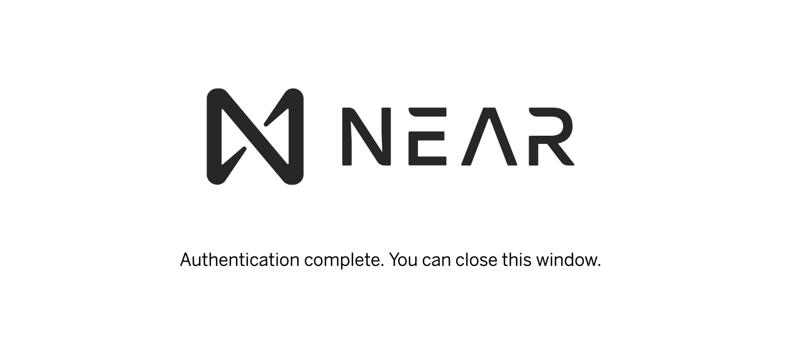

# NEAR AI CLI

NEAR AI CLI allows you to [create and deploy agents](./agents/quickstart.md), [train and test models](./models/home.md), and more!

---

## Installing NEAR AI CLI

!!! warning
    Requires Python version **`3.11`** _(Currently does not work with `3.12` or `3.13`)_

!!! tip
     Although not required, this project uses [uv](https://docs.astral.sh/uv/) for Python package management and it is suggested that you use it as well if you would like to make contributions to this project.

=== "pip"

    ``` bash
    python3 -m pip install nearai
    ```

=== "local"

    ``` bash
    git clone git@github.com:nearai/nearai.git
    cd nearai
    ./install.sh
    ```

---

## Login to NEAR AI

To create a new agent, first login with a [NEAR Account](https://wallet.near.org/):

``` bash
nearai login
```

??? tip "Don't have a NEAR Account?"

    If you do not have a NEAR account, you can create one for free using wallets listed at [wallet.near.org](https://wallet.near.org/). 
    
    If you are unsure of which one to choose, try out [Bitte](https://wallet.bitte.ai) or [Meteor Wallet](https://wallet.meteorwallet.app/add_wallet/create_new).

You'll be provided with a URL to login with your NEAR account.

Example:

``` bash
$> nearai login

Please visit the following URL to complete the login process: https://auth.near.ai?message=Welcome+to+NEAR+AI&nonce=<xyzxyzxyzxyzx>&recipient=ai.near&callbackUrl=http%3A%2F%2Flocalhost%3A63130%2Fcapture
```

After successfully logging in, you will see a confirmation screen. Close it and return to your terminal.




??? tip "Other Login Methods"

    If you have already logged in on `near-cli`, you know your account's private key, or you have the credentials on another device, you can use the following commands to login:

    ```bash
    ### Login with NEAR Account ID Only
    nearai login --accountId name.near

    ### Login with Account ID and Private Key
    nearai login --accountId name.near --privateKey key

    ### Login Remotely (only displays the login URL)
    nearai login --remote
    ```

---

## Next Steps

That's it! Head over to the [Agent Quickstart](./agents/quickstart.md) to get started creating your first agent! 🚀