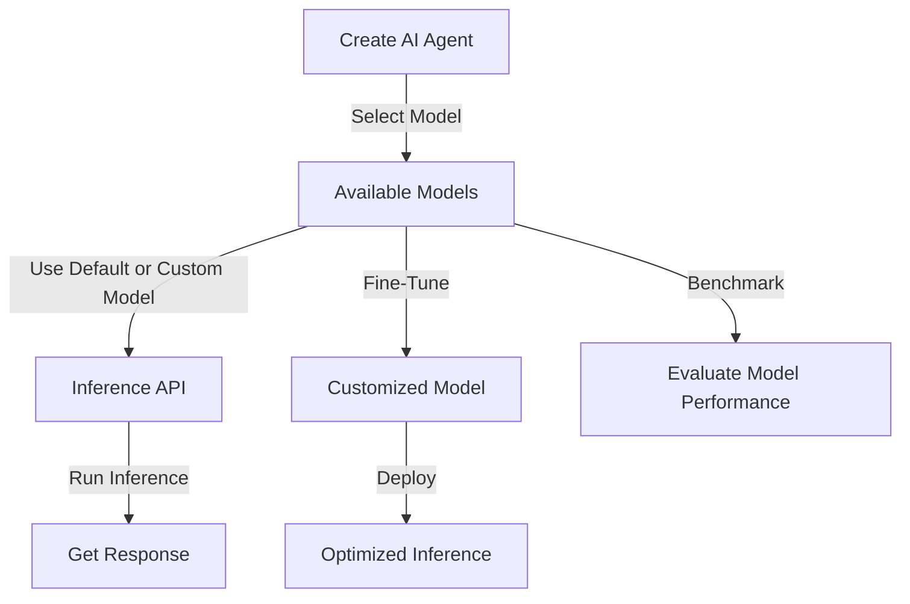

# Getting Started with NEAR AI Models

NEAR AI provides access to powerful **open-source AI models** to help you build and deploy AI agents. 
With **OpenAI-compatible inference**, you can seamlessly integrate models into your applications for **chat completions, structured outputs, and function calling**.

NEAR AI supports multiple inference providers to optimize performance, ensuring fast and scalable execution of AI models.

---

## Understanding how to use Models

The **Models** section is structured as follows:

- **Using Models** – How to interact with available models.
- **Fine-Tuning** – Customize models for specific use cases.
- **Benchmarks & Evaluations** – Assess model performance.
- **Inference API** – Details on running inference and API usage.
- **Model Providers** – Overview of different model providers available on NEAR AI.

---

## Overview of AI Models

NEAR AI offers a range of AI models for different applications, such as **chat completions, structured data processing, and function calling**. These models are accessible via the **NEAR AI Inference API**, ensuring developers can integrate and experiment effortlessly.



---

## Logging into NEAR AI

To use models, first log in to NEAR AI:

```bash
$> nearai login
```

You'll be prompted to visit a URL to authenticate with your Near wallet. After successful authentication, close the page and return to your terminal.

---

## Listing Available Models

To view all supported models on NEAR AI, run:

```python
import openai
import json
import nearai

hub_url = "https://api.near.ai/v1"
auth = nearai.config.load_config_file()["auth"]
signature = json.dumps(auth)

client = openai.OpenAI(base_url=hub_url, api_key=signature)

models = client.models.list()
print(models)
```

Each model follows the format: `provider::account/model_name/model_version`.
To list all providers:

```python
providers = set([model.id.split("::")[0] for model in models])
print(providers)
```

---

## Running Inference

To run a **prompt** on a specific **model**:

```python
messages = env.list_messages()
result = env.completion(messages)

print("Messages:", messages)
print("Result:", result)
```

### Overriding the Default Model

To specify a different model, pass `MODEL` or `PROVIDER::MODEL`:

```python
messages = env.list_messages()
result = env.completion([prompt] + messages, "provider::model-name")
```

---

## Creating a Chat Completion

Example request to generate AI responses:

```python
completion = client.chat.completions.create(
model="provider::account/model-name",
messages=[
    {"role": "system", "content": "You are a helpful assistant."},
    {"role": "user", "content": "Hello, how are you?"}
  ]
)

print(completion.choices[0].message.content)
```

---

## Next Steps

You are now set up to use different models. Here’s what you can do next:

- **[Create AI Agents](./agents.md)** – Learn how to build and deploy AI-powered agents.
- **[Explore the Model Registry](./registry.md)** – Browse and select models for your use case.
- **[Function Calling Guide](./function-calling.md)** – Learn how to structure model outputs for your applications.
- **[NEAR AI API Reference](https://docs.near.ai/)** – Deep dive into the API functionalities.

---

## Frequently Asked Questions

### 🔹 How do you create agents on NEAR AI?

You need to **install NEAR AI**, authenticate with a Near wallet, and use the `nearai` CLI to create an agent.

### 🔹 How can you change models?

Modify the model in API requests or update the **metadata.json** of your agent.

### 🔹 Where does inference happen?

Inference runs on multiple AI providers supported by NEAR AI.

### 🔹 How many models are supported?

NEAR AI supports **multiple open-source models**. Run `client.models.list()` to see the full list.

### 🔹 How can you fine-tune models?

Fine-tuning depends on the model provider. Some providers support **custom fine-tuning** for select models.

### 🔹 Are there token or inference limits?

Yes, limits depend on your **account tier and model specifications**. Check the API documentation for exact quota details.

### 🔹 Do I need a Near wallet to use NEAR AI?

Yes, authentication requires a Near wallet.

### 🔹 How does function calling and structured data work?

NEAR AI **follows OpenAI’s standard** for function calling and structured data processing.

