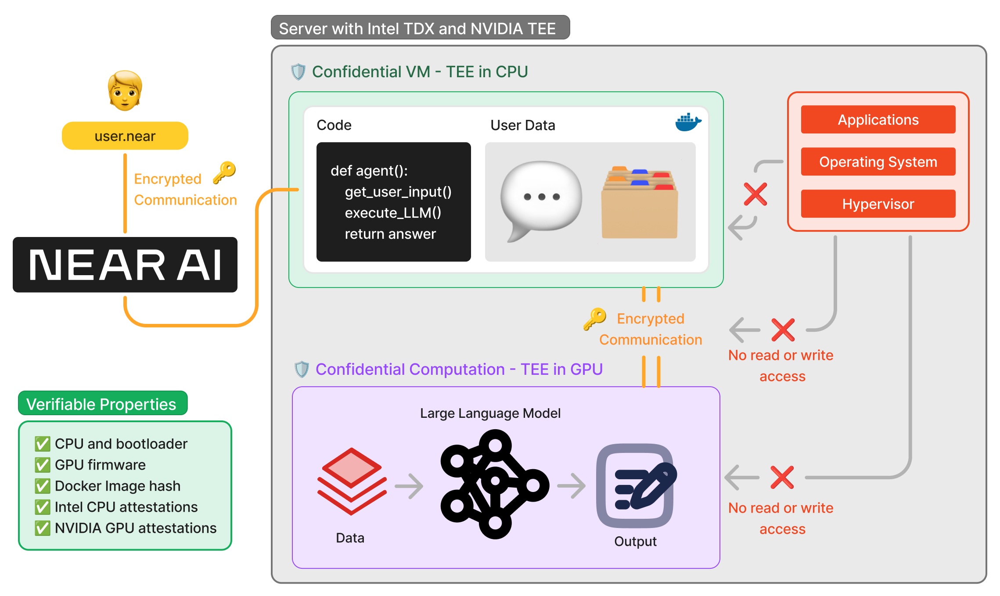

# Private and Verifiable AI

Thanks to a combination of cryptographic techniques and secure hardware, NEAR AI is private and verifiable every step of the way. From interacting with agents, to training your own models, you can be sure that your data is secure and the results are not tampered with.

NEAR AI leverages technology from Intel and NVIDIA to keep your data safe and isolated

To execute the agent securely, NEAR AI uses Intel TDX technology to create a [Confidential Virtual Machine (CVM)](https://www.intel.com/content/www/us/en/developer/tools/trust-domain-extensions/overview.htmlml), this is, a virtual machine that runs in an isolated environment within the CPU. Within this CVM, a Docker container that has the agent's code and user data is deployed and executed. 

Whenever the agent needs to make an inference, NVIDIA TEE technology is used to create a [Confidential Space within the GPU](https://www.nvidia.com/en-us/data-center/solutions/confidential-computing/) and establish an encrypted channel for communication. The model is loaded into the Confidential Space, where it is executed in an isolated environment.

It is important to remark that both CPU and GPU Confidential Spaces are **completely isolated** from the rest of the system. Neither the operating system nor the hypervisor (in charge of managing the virtual machines) have access to the code or data being executed.

??? note "Want to dive deeper?"

    We are open-sourcing the technology that powers NEAR AI. If you are interested in learning more about how we are building this secure and private AI, check out our [Private ML SDK](https://github.com/nearai/private-ml-sdk) on GitHub. 

---

## How Can I Trust It?

Before executing in the server, NEAR AI checks that the hardware is properly configured, and that the Docker container has the proper image hash. This ensures that the agent is running in a secure environment, and that the code being executed is the one you expect.

After the agent executes, NEAR AI checks its correctness by checking the attestations provided by the TEEs. These attestations are cryptographic proofs that the agent executed in a secure environment, and that the code and data were not tampered with. 

---

## How Can I Use it?

Right now we are beta testing this technology, but soon we will open it to the public for everyone to use it. In the near future, all agents and models will run in this secure environment, ensuring that your data is always safe and the results are correct.

Stay tuned for more updates!
