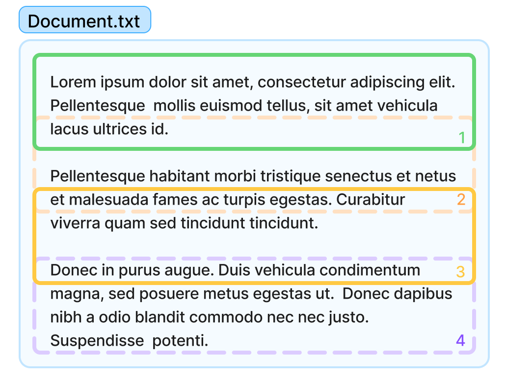

# Chunking

Before transforming the docs into embeddings, the NEAR AI platform divides them into smaller chunks of text. 

Chunking a document does not only make it less computationally expensive to process, but also allows the model to better understand the document as a whole.

!!! tip
    Embedding models transform documents (wherever their size) into fixed-size vector. By dividing the document into smaller chunks, we can better represent the document as a whole.

    This is, it is better to have multiple vectors representing small sections, than a single vector representing the whole document.

!!! warning
    It's very likely you don't need to worry about chunking, only change it if you find that the agent consistently fails at answering questions because of how documents are divided in chunks

---

## Chunking Strategy

When creating the vector store we left a parameter commented in the code, the `chunking_strategy`. This parameter allows you to specify how the documents are "split" into chunks before being processed by the model.

```python
vs = client.beta.vector_stores.create(
    name="docs-vector-store-chunks",
    file_ids=file_ids,
    # chunking_strategy={
    #     "chunk_overlap_tokens": 400,
    #     "max_chunk_size_tokens": 800
    # }
)
```

The `chunking_strategy` parameter is a dictionary that can have the following keys:
    - `chunk_overlap_tokens`: The number of tokens that the chunks will overlap. Default is 400.
    - `max_chunk_size_tokens`: The maximum number of tokens that a chunk can have. Default is 800.

By default, the platform will divide the document into chunks of 800 tokens, with an overlap of 400 tokens.



It is important to notice that chunks are not created based on the document's structure, but merely on counting tokens, which can lead to a loss of context.

Make sure you change the `chunking_strategy` to better fit your documents' structure. For example, if your documents have a lot of code snippets, you can increase the `size` and `overlap` to make sure that the code can be correctly retrieved by the vector store.