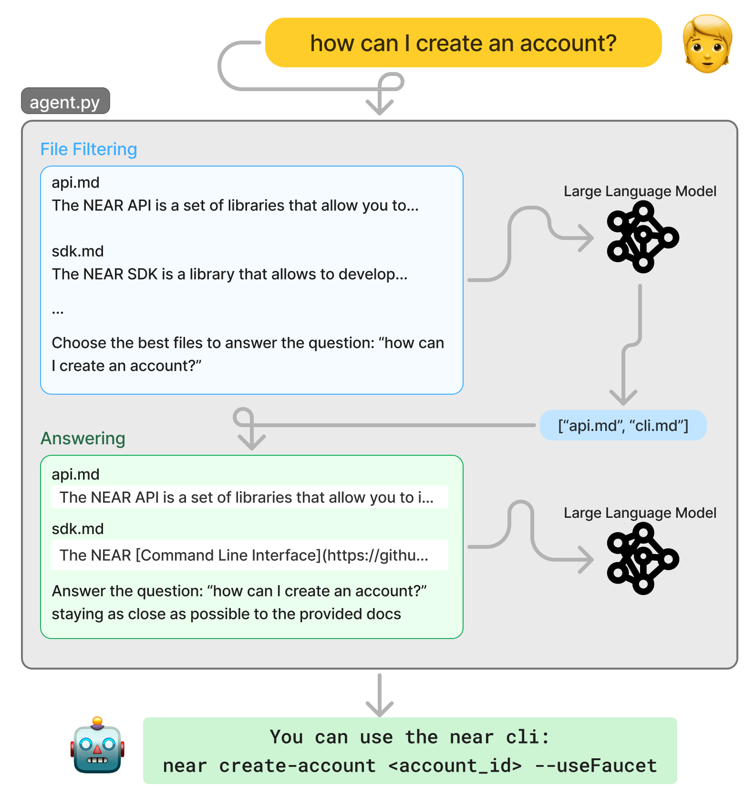

# Using RAG to Build a Docs Agent

Current AI models are trained on a wide variety of data sources, which makes them incredibly good at generating text for broad topics. However, if you need your agent to talk about a niche domain (e.g. data from your own products), chances are that the model will start to hallucinate.

To solve this problem you can use a technique called Retrieval-Augmented Generation (RAG). RAG is as simple as combining two models:

1. One retrieval model to find relevant information from a structured dataset
2. A generation model to generate the response from the retrieved information

In this tutorial, we will show you how to build a simple agent that uses RAG to answer questions about NEAR! For this, we will use part of our documentation to build a dataset that the agent will use to generate responses.

---

## The Simplest RAG Agent

Just to exemplify the concept of RAG, lets start by checking a very simple agent that [answers questions about NEAR Protocol tools.](https://app.near.ai/agents/gagdiez.near/docs-simplest/latest/run)

This agent has access to 4 markdown files - `api.md`, `cli.md`, `explorer.md`, and `sdk.md` - and implements a simple mechanisms to answer questions:

1. Create a filtering prompt, that includes all the files' content and the user's question, and task a model to choose the best files to answer the question
2. Use another prompt, that includes the chosen files and the user's question, to task another model with generating the answer

While useful to understand the concept, this agent has a very important limitation: **it cannot scale** to a large number of documents.

Since we are loading all documents into the prompt, soon we will hit a limit on the number of tokens that the model can process.

To solve this problem, we need to use rely on a special kind of database called a **Vector Store**.