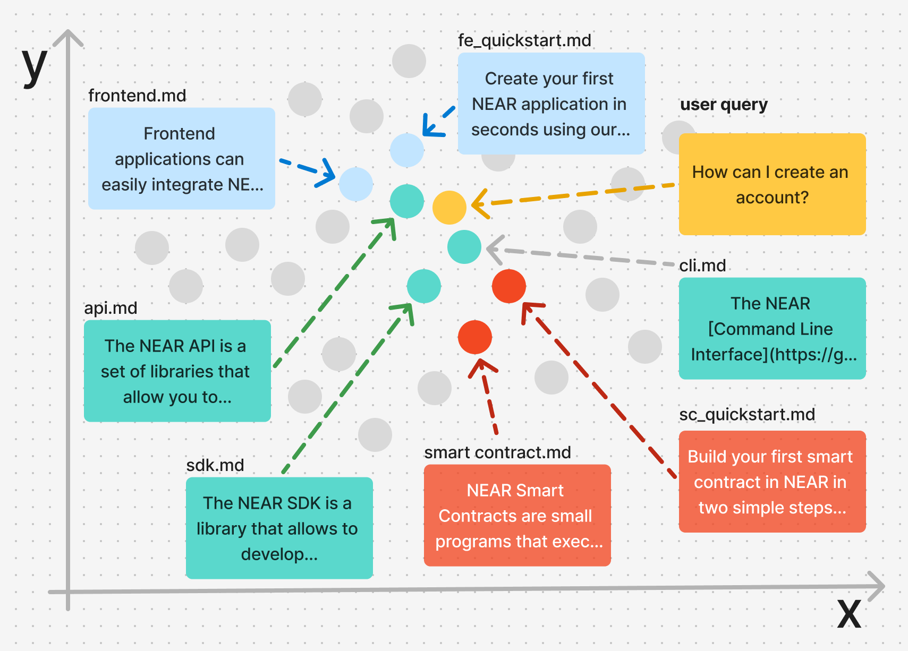

Vector Stores are a special kind of database that stores documents and allows to retrieve them through natural language. 

In our case, we will store all documentation from NEAR AI, and then retrieve the most relevant documents to answer a query by searching the documents with the query itself.

!!! info
    The Vector Store is built separately from the agent, and can be used in multiple places

!!! tip
    You can find the dataset and code used in this tutorial in the [vector store example](https://github.com/gagdiez/docs-ai/tree/main/docs-gpt/dataset) repository


---

## How Vector Stores Work

Vector Stores use AI models to convert documents into low-dimensional numerical representations. For example, the [Nomic v1.5](https://huggingface.co/nomic-ai/nomic-embed-text-v1.5) model represents this whole [`cli.md`](https://github.com/near/docs/blob/master/docs/4.tools/cli.md) as the vector  `[0.01025390625, 0.048309326171875, -0.166015625, ... , -0.004741668701171875, -0.048553466796875]`

!!!tip
    How these representations are generated is a complex topic that exceeds the scope of this tutorial. For us, it suffices to know that such models already exist and are available for us to use

Ideally, documents that are semantically similar will have similar numerical representation, and thus end up relatively close within this vectorial space.



More importantly, user queries can directly be converted into the same vectorial space, allowing us to find the documents needed to answer it by looking at their relative distances.

---

## Creating a Vector Store

Let's create a vector store using the official documentation, which consists of a set of markdown files.

Creating a vector store in NEAR AI consist in 2 main steps: **uploading the files** to NEAR AI, and **assigning them** to a vector store. Here is the full code:

```python
import json
from glob import glob

import openai
import nearai

# Load NEAR AI Hub configuration
config = nearai.config.load_config_file()
base_url = config.get("api_url", "https://api.near.ai/") + "v1"
auth = config["auth"]

client = openai.OpenAI(base_url=base_url, api_key=json.dumps(auth))

# Create a vector store for vector store docs
md_files = list(glob("./**/*.md", recursive=True))
file_ids = []

for file_path in md_files:
    print(f"Processing {file_path}")

    with open(file_path, 'r', encoding='utf-8') as file:
        uploaded_file = client.files.create(
            file=(file_path, file.read(), "text/markdown"),
            purpose="assistants"
        )
        file_ids.append(uploaded_file.id)

vs = client.beta.vector_stores.create(
    name="docs-vector-store-chunks",
    file_ids=file_ids,
    # chunking_strategy={
    #     "chunk_overlap_tokens": 400,
    #     "max_chunk_size_tokens": 800
    # }
)

print(vs.id)
```

<hr class="subsection" />

### How it works?

In the code above we are first instantiating an OpenAI compatible client

!!! note
    While we are using a OpenAI client, the files are being uploaded to the NEAR AI platform, not OpenAI

```python 
# Load NEAR AI Hub configuration
config = nearai.config.load_config_file()
base_url = config.get("api_url", "https://api.near.ai/") + "v1"
auth = config["auth"]

client = openai.OpenAI(base_url=base_url, api_key=json.dumps(auth))
```

Then, we list all markdown files in the current directory and its subdirectories

```python
md_files = list(glob("./**/*.md", recursive=True))
```

For each file, we read its content and upload it to the NEAR AI platform

```python
for file_path in md_files:
    print(f"Processing {file_path}")

    with open(file_path, 'r', encoding='utf-8') as file:
        uploaded_file = client.files.create(
            file=(file_path, file.read(), "text/markdown"),
            purpose="assistants"
        )
        file_ids.append(uploaded_file.id)
```

Finally, we create a vector store with the uploaded files and print its `id`

```python
vs = client.beta.vector_stores.create(
    name="docs-vector-store-chunks",
    file_ids=file_ids,
    # chunking_strategy={
    #     "chunk_overlap_tokens": 400,
    #     "max_chunk_size_tokens": 800
    # }
)

print(vs.id)
```

After running the script, you will get the `id` of the vector store that was created.

This `id` will be used in the next section to build an agent that leverages the knowledge contained on it.


??? tip "Where are the Embeddings?"

    All the complexity of processing the files to create embeddings, and then storing them in a database to be queried, is abstracted away by the platform
    
    You only need to upload the files and the platform will take care of the rest

!!! note "Chunking Strategy"
    In the code above we have commented the `chunking_strategy` parameter, which allows you to specify how the documents are "split" into chunks before being processed by the model.

    Do not worry about this parameter for now, we will come back to it later in this tutorial.

---

## Preprocessing the Files

While the platform abstracts away the complexity of creating embeddings, it is still a good idea to preprocess the files before uploading them.

In our case, our `markdown` files contain a lot of unnecessary information, such as `imports`, `iframes` and other tags that the model simply will not know how to interpret.

Furthermore - and this might be common to many documentation files - our files do not necessarily contain the plain-text code snippets, but instead embed them from external sources (e.g. GitHub).

In case you are curious, you can file all the preprocessing steps we use in our [vector.py script](https://github.com/gagdiez/docs-ai/blob/main/docs-gpt/dataset/vector.py#L12-L65)